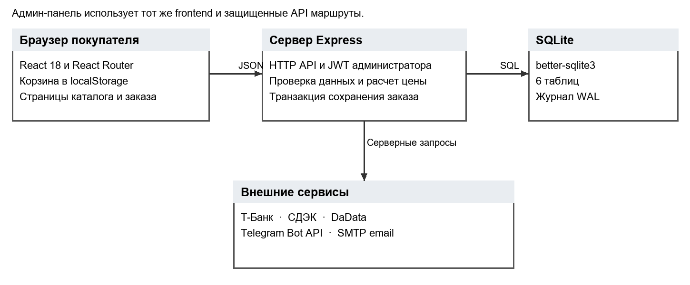
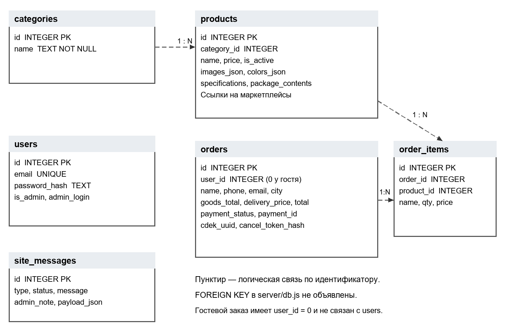

# Regola Store — материалы производственной практики ПМ11

Regola Store — собственный проект Гюльтекина Ильяса Хайдаровича, группа 07-23.ИСИП.ОФ.9. Проект используется для производственной практики ПМ11 «Разработка, администрирование и защита баз данных».

- Проект: [github.com/merhab228/regola-store](https://github.com/merhab228/regola-store)
- Работающий сайт: [regola.shop](https://regola.shop)
- Демонстрация: [merhab228.github.io/regola-store](https://merhab228.github.io/regola-store/)
- Место практики: АНПОО «Хекслет колледж», Санкт-Петербург, ул. Мира, 3

## Назначение проекта

Интернет-магазин позволяет просматривать дверные ручки, изучать карточки товаров, хранить корзину и оформлять гостевые заказы. Администратор управляет каталогом, заказами и обращениями. Сервер хранит данные в SQLite, рассчитывает сумму по актуальным ценам базы и взаимодействует с Т-Банком, СДЭК, DaData, Telegram Bot API и SMTP при наличии настроек.

## Технический паспорт

| Компонент | Реализация |
| --- | --- |
| Frontend | React 18, Vite 7, React Router, Context API, CSS |
| Backend | Node.js 22, Express 4 |
| База данных | SQLite, better-sqlite3, WAL |
| Авторизация | JWT администратора, bcrypt, проверка роли |
| Развертывание | Docker, Docker Compose, GitHub Actions, VPS |
| Резервное копирование | SQLite backup API, `integrity_check`, срок хранения копий |
| Платежи | Т-Банк |
| Доставка | СДЭК |
| Уведомления | Telegram и SMTP email |

## Архитектура



Frontend обращается к Express API. Сервер проверяет запросы и выполняет параметризованные операции с SQLite. Оформление заказа загружает цены из базы и сохраняет `orders` и `order_items` в одной транзакции. Секреты внешних сервисов остаются на сервере.

## Модель данных



| Таблица | Назначение |
| --- | --- |
| `users` | Учетные записи, хеши паролей и роль администратора |
| `categories` | Категории каталога |
| `products` | Карточки, цены, характеристики и медиа товаров |
| `orders` | Контакты покупателя, доставка, оплата, суммы и статус |
| `order_items` | Позиции заказа со снимком названия и цены |
| `site_messages` | Вопросы, заявки и служебные заметки |

Поля `category_id`, `order_id` и `product_id` задают логические связи. В текущем DDL ограничения `FOREIGN KEY` не объявлены. Гостевой заказ содержит `user_id = 0`. Перед добавлением внешних ключей необходимо определить модель гостевого покупателя и правила сохранения истории при удалении товара.

## Основные сценарии

1. Покупатель открывает каталог, выбирает товар и изучает карточку.
2. Покупатель добавляет товары в корзину и меняет количество.
3. Покупатель выбирает пункт СДЭК, оформляет заказ и переходит к оплате.
4. Покупатель просматривает состояние заказа и может запросить отмену по индивидуальному токену.
5. Администратор входит в панель, изменяет товары и обрабатывает заказы и обращения.

## Основные API

| Метод | Маршрут | Назначение |
| --- | --- | --- |
| `GET` | `/api/products` | Каталог с поиском, категорией и сортировкой |
| `GET` | `/api/products/:id` | Карточка активного товара |
| `POST` | `/api/checkout` | Проверка и создание заказа |
| `POST` | `/api/contact` | Вопрос или заявка |
| `POST` | `/api/cdek/estimate` | Расчет доставки |
| `POST` | `/api/admin/login` | Вход администратора |
| `POST`, `PUT`, `DELETE` | `/api/admin/products[/:id]` | Управление каталогом |
| `GET`, `PATCH` | `/api/admin/orders`, `/api/admin/orders/:id/status` | Обработка заказов |
| `GET`, `POST` | `/api/orders/:id/status`, `/api/orders/:id/cancel` | Состояние и отмена заказа |

## Трассировка реализации

| Функция | Исходный код | Страница |
| --- | --- | --- |
| Каталог, карточка, корзина и админ-панель | [`src/App.jsx`](../../src/App.jsx) | [`/`](https://regola.shop/), [`/cart`](https://regola.shop/cart), [`/admin`](https://regola.shop/admin) |
| Клиентское состояние и API | [`src/context/StoreContext.jsx`](../../src/context/StoreContext.jsx) | [`/cart`](https://regola.shop/cart) |
| Оформление и защита цены | [`server/checkout.js`](../../server/checkout.js) | [`/cart`](https://regola.shop/cart) |
| SQL схема | [`server/db.js`](../../server/db.js) | Серверный компонент |
| Авторизация | [`server/middleware/auth.js`](../../server/middleware/auth.js) | [`/admin`](https://regola.shop/admin) |
| Платежи | [`server/tbank.js`](../../server/tbank.js) | [`/payment`](https://regola.shop/payment) |
| Доставка | [`server/cdek.js`](../../server/cdek.js) | [`/cart`](https://regola.shop/cart) |
| Резервное копирование | [`scripts/backup-db.mjs`](../../scripts/backup-db.mjs) | Серверный компонент |

## Демонстрация

Страница [merhab228.github.io/regola-store](https://merhab228.github.io/regola-store/) воспроизводит запись выполнения настоящего модуля `server/checkout.js` на изолированной SQLite базе в памяти. В запросе намеренно передаются неверные `price=1` и `total=2`; сервер читает цену 2490 рублей из базы и получает для двух товаров 4980 рублей, затем добавляет 310 рублей доставки. Итог равен 5290 рублей. Отрицательное количество отклоняется, а число заказов не меняется.

Демонстрация воспроизводится локально командой `npm run demo:practice`. Она не создает боевых заказов и не вызывает платежные или логистические API.

## Защита и администрирование

- пароль администратора хранится как bcrypt-хеш;
- JWT ограничен сроком восемь часов;
- защищенные API проверяют авторизацию и роль;
- число попыток входа ограничено;
- SQL значения передаются параметрами;
- цена заказа повторно загружается из базы;
- токен отмены хранится как SHA-256 хеш;
- резервная копия проверяется через `PRAGMA integrity_check`.

Для входа в действующую административную панель используются значения `ADMIN_LOGIN`, `ADMIN_PASSWORD` и `ADMIN_ACCESS_KEY`, установленные владельцем сервера. Секреты не публикуются в репозитории.

## Проверка

```bash
npm ci
npm test
npm run demo:practice
npm run build
```

GitHub Actions выполняет установку зависимостей, полный набор серверных тестов и production-сборку при каждом изменении ветки `main`. Его текущий результат виден в бейдже README.
